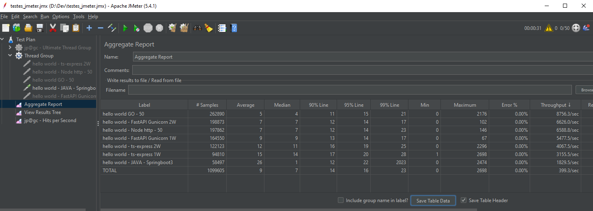

# PERFORMANCE TEST

## GO x EXPRESS x NODE-HTTP x FASTAPI
---------------------------------------
### START APIS:

* GO: go run hello.go 
* node-http: node main.js
* ts-express: npm install | npm run build | npm run start
* fastapi: gunicorn main:app --workers 1 --worker-class uvicorn.workers.UvicornWorker --bind 0.0.0.0:8000

-------------------------------------

# PRINT TEST

